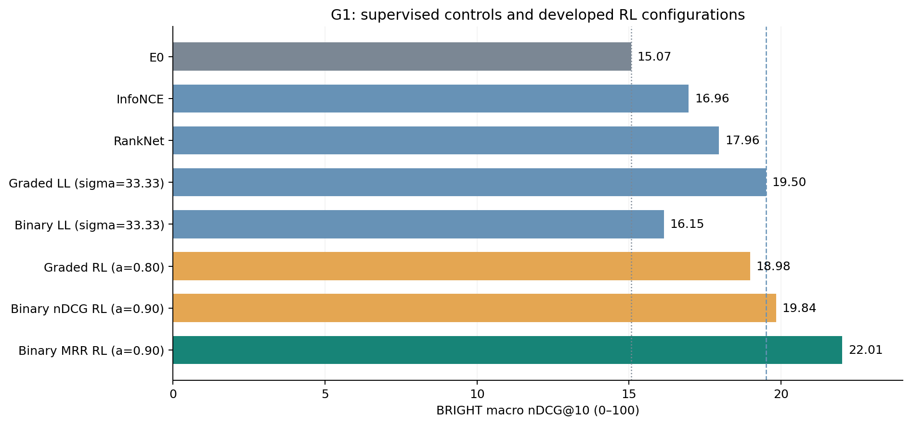
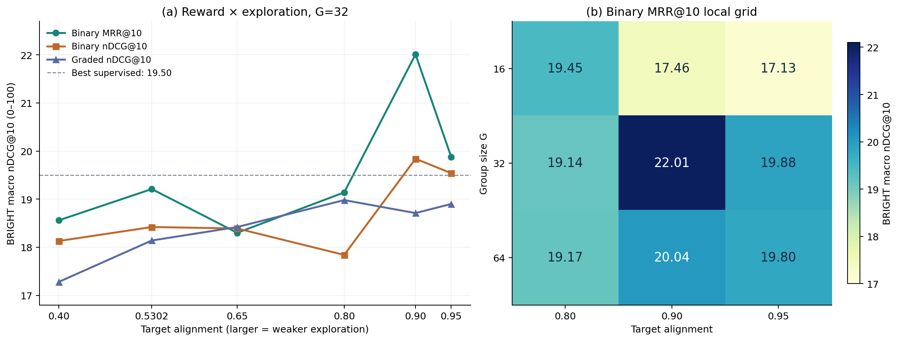
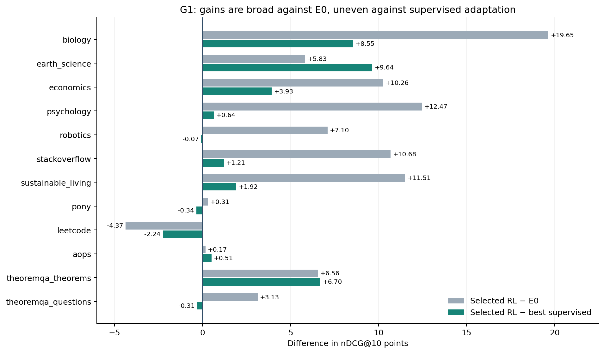

# G1 实验结果：ReasonRank 适配中的奖励目标、探索与双侧策略更新

结果快照：2026-09-14。本文是独立实验结果文档，按论文的实验设置、主结果、消融、讨论和局限组织；不修改现有论文正文。数值来源为本地已导入的 **45 次训练 + 1 次 E0 评测，共 46 个配置、552 条领域结果**。训练配置均标记为 seed 42。

正文聚焦最终配方及其有效对照：监督适配、reward × exploration 扫描、MRR 0.90 机制消融和 group size 网格。早期 σ=1 的 LL、初始 graded nDCG 机制消融及退火/采样失配诊断仅保留在[完整附表](g1_results/all_runs.md)，不再逐项展开。

## 摘要

在清理后的 4,963 条 ReasonRank 训练记录上，对 `Qwen/Qwen3-Embedding-0.6B` 进行固定预算的适配，最佳已测 RL 配置在 BRIGHT 12 领域宏平均 nDCG@10 上达到 **22.01**，较原始模型 E0 的 15.07 提升 **6.94 分（相对 46.05%）**，较当前最强监督对照 graded LambdaLoss-Scaled 的 19.50 提升 **2.51 分（相对 12.87%）**。该配置使用 binary MRR@10 奖励、双侧 vMF product rollout、group size 32、固定 target alignment 0.90、leave-one-out baseline、不做 advantage 标准化、文档 log-prob 求和，并保留冻结候选分数校准。

结果支持三个主要观察。第一，奖励目标与探索强度需要联合考虑：binary MRR 在六个探索点中的五个优于 binary nDCG，但优势随探索设置变化，并非固定收益。第二，双侧 policy、product rollout、文档求和及不做 advantage 标准化在最终配方中均有正向消融证据，校准的贡献相对较小。第三，group size 与 alignment 存在描述性交互，增加采样数并不单调改善结果。

最佳 RL 在 11/12 个领域优于 E0，在 8/12 个领域优于最强监督对照，但后者的净增益约 82.6% 来自 biology、earth_science 和 theoremqa_theorems。LeetCode 相对 E0 仍下降 4.37 分。由于后续配置依据 BRIGHT 反馈开发，且只有单 seed 和聚合分数，本文将 22.01 定位为**当前搜索范围内的最佳配置开发结果**，不作独立测试集确认、统计显著性或一般性推理能力提升的主张。

## 1. 研究问题与证据范围

G1 考察已有 embedding model 经 reasoning retrieval 数据适配后的检索表现，主要回答：

1. 在相同数据、初始化和更新预算下，已测 RL 配方能否超过监督适配？
2. 奖励使用的标签、排序指标和探索强度如何影响结果？
3. Query/document policy、rollout 组合、校准和梯度聚合各起什么作用？
4. 增加 group size 是否改善表现，其作用是否随探索强度变化？
5. 宏平均增益覆盖哪些领域，又伴随哪些能力退化？

本地证据分为三个层次。**结果事实**来自 [run_summary.csv](_summary/g1_bright/run_summary.csv) 和 [subset_summary.csv](_summary/g1_bright/subset_summary.csv)；**运行设计和配置解释**来自 [实验计划](EXPERIMENT_PLAN.md)、[suite.yaml](../configs/experiments/iclr2027/suite.yaml)、[公共参数](../configs/experiments.yaml) 及配置解析器；**数据事实**来自 [reasonrank_multi/summary.json](../data/processed/reasonrank_multi/summary.json)、[manifest.json](../data/processed/reasonrank_multi/manifest.json) 与[重叠审计](REASONRANK_BRIGHT_AUDIT.md)。本地数据产物受 Git ignore 管理，跨机器阅读可使用第 2 节转录的统计和第 10 节的哈希。

本次检查确认所有 46 行都包含同一组 12 个 subset，汇总中 `tasks_missing=0`、`errors=0`，无重复 run/subset。这里的 `tasks_found=1` 指一个 `BrightRetrieval` 任务，不是只评了一个领域；`retrieval_ood` 与主分数相同也不是额外的 OOD 评测证据。远端逐 run 原始结果 JSON、训练日志与启动配置快照未包含在当前结果目录中，因此本文没有重新执行评测，也不将当前配置文件等同于逐 run 的历史执行证明。

## 2. 实验设置

### 2.1 数据清理、训练规模与候选

ReasonRank 原始 train 有 6,721 条记录。当前实际多正例预处理产物的互斥处理结果如下；这些计数来自最终数据 summary，而非早期审计中的可用量估算。

| 处理结果 | 记录数 |
|---|---:|
| 保留为训练记录 | 4,963 |
| 排除 MSMARCO 来源 | 1,546 |
| 按 BRIGHT 保守重叠清单隔离 | 133 |
| 隔离 relevance 冲突 | 61 |
| 排除无负例记录 | 17 |
| 排除重复 query | 1 |
| 合计 | 6,721 |

不留内部 dev；原始 val 的 50 条数学记录也不用于全局选模。保留样本的候选数为 2–20，平均 **17.19**；平均正例数为 **3.19**，其中 **3,836/4,963（77.29%）**的记录包含多个正例。多正例身份与 teacher 排序分别保存；按 seed 42 为每条 query 固定选择一个 in-batch 代表正例，不删除其余已知正例。

| 训练来源 | biology | earth_science | economics | robotics | sustainable_living | stackoverflow | leetcode | math-qa | math-theorem | 合计 |
|---|---:|---:|---:|---:|---:|---:|---:|---:|---:|---:|
| 记录数 | 807 | 244 | 362 | 210 | 54 | 843 | 804 | 856 | 783 | 4,963 |

审计使用规范化文本匹配、字符相似度和包含关系筛查，并保守隔离 133 条。这不是完整语义去污染认证，也没有审计基础模型预训练数据。本文采用最终多正例路径 `data/processed/reasonrank_multi/train.ready.jsonl`；根目录 README 中仍出现的 `reasonrank_simple` 和“移除其余正例”属于旧路径说明，不用于解释本组结果。

### 2.2 公共训练与评测协议

| 项目 | 本组采用的协议 |
|---|---|
| 初始化 | 原始 `Qwen/Qwen3-Embedding-0.6B`，记为 E0 |
| 参数更新 | Full fine-tuning；query 与 document 使用同一共享 encoder |
| 每次训练预算 | 113 optimizer steps；global batch 128 |
| 默认并行设置 | 8 workers，每卡 microbatch 16，gradient accumulation 1 |
| 名义 query 暴露量 | 113 × 128 = 14,464，约相当于 2.91 次数据遍历；不是新增独立样本数 |
| 优化器 | AdamW，LR 5e-6，weight decay 0.01，max grad norm 1.0 |
| 学习率调度 | Linear，warmup ratio 0.03 |
| Seed | 训练 seed、data seed、in-batch 正例选择 seed 均为 42 |
| 训练长度上限 | Query 512 tokens；document 1,024 tokens |
| 表示协议 | Last-token pooling、left padding、append pad；query 使用 instruction 模板，document 使用原文模板 |
| 评测表示长度 | 模型配置中的 `embedding_max_length=8192` |
| 选模 | 固定预算后的最终 checkpoint；不依据中间 checkpoint 的 BRIGHT 分数选模 |
| 评测 | `BrightRetrieval`，逐 subset 独立全库检索，12 个领域等权宏平均 nDCG@10 |

训练候选是本条 query 的固定变长列表，加上 device-local microbatch 中其他 query 的代表正例。相同文本/ID 合并，跨 query 的已知正例被 mask；其他跨 query 文档作为近似负例，且它们的表示 detach。梯度累积和多卡 global batch 不会把这个候选池自动扩大到 128 个 query。候选补齐项由有效 mask 排除。

依据当前评测入口和结果路径，本组按 **original query、joint encoder evaluation** 协议解释：训练后模型同时编码 query 和 passage，12 个领域的 corpus 分别搜索，不将全部 corpus 合并。当前汇总不包含 `query-gpt-reasoning` 路径，也没有固定 E0 corpus 的 `G1-DR` 结果；不把扩展 query 或固定索引部署的结论混入本组。此协议解释仍以远端原始评测元数据作为最终复现依据。

**每次训练预算一致不等于搜索预算或算力一致。** RL 有更多配置开发试验；product rollout 的奖励组合数也随 G² 变化。本组公平性指向固定数据暴露和更新步数下的配方比较，不是同总调参成本或同 wall-clock 的方法竞赛。

### 2.3 目标与 RL 配方

| 方法 | 标签或目标 | 关键解释 |
|---|---|---|
| InfoNCE / CL | 全部已知正例的 multi-positive 对比损失 | 每个正例分别与有效负例构造分母，再对正例和 query 平均；temperature 0.03 |
| RankNet / RN | 完整 teacher 顺序 | 对本条候选的 teacher 排序构造有序 pairs；temperature 0.03 |
| Graded LambdaLoss-Scaled / LL-Scaled | Teacher grades 上的 nDCG@10 加权 pairwise logistic | Grades 为 teacher 第 1 名 3、第 2–5 名 2、第 6–10 名 1，其余 0；gain 为 2^rel−1；σ=1/0.03≈33.33 |
| Binary LambdaLoss-Scaled | 全部已知正例的 binary nDCG@10 加权监督 | 同样使用 σ≈33.33；与 binary nDCG RL 对齐标签和指标，不是 MRR 的完全同目标控制 |
| Graded nDCG RL | Teacher-derived graded nDCG@10 reward | 是 teacher 排序信息的适配，不能称为人工多级 relevance |
| Binary nDCG RL | 已知正例 binary nDCG@10 reward | 与 binary MRR 的对比隔离奖励指标 |
| Binary MRR RL | 第一个已知正例的 reciprocal rank，截断于 10 | 即命中排名 r≤10 时为 1/r，否则为 0；有多个正例时仍只由第一个命中决定 |

所有表中的**评测指标均为 BRIGHT nDCG@10**；MRR 只表示某些行的训练奖励。CL 的正例身份与 teacher-order 方法的信息来源不同，不能把 CL/RL 差异完全归因于优化估计器。

默认 RL 用 vMF 在单位球面上对 query 和整组本条文档分别采样 G 次，product rollout 组合成 G×G 个奖励计算；这些组合共享采样分量，不是 G² 个独立样本。`alignment = E[cos(action, mean)]` 表示动作与中心表示的期望余弦，越接近 1，探索越弱。早期配置使用 κ=755，对应约 0.530237；显式给定 target alignment 时，由它决定探索强度，不能将继承的 κ=755 误写成最佳配方的实际浓度。

最佳配方为：`MRR@10 / binary / G=32 / alignment=0.90 / fixed exploration / vMF / product / leave-one-out / advantage_norm=none / document_log_prob_reduction=sum / frozen_doc_rescale=true / KL=0`。每个消融均从 E0 独立训练，复用对照的评测分数，不从对照 checkpoint 续训。

### 2.4 分数与统计口径

报告单位为 nDCG@10 × 100；“提升 x 分”表示绝对分数差，“相对提升”表示 `(新分数 / 对照分数 − 1) × 100%`。宏平均以 run CSV 为准，领域值以 subset CSV 为准。两者从原始精度独立舍入到两位小数，因此重新平均领域表可能与原宏平均相差 0.01；本次最大差值为 **0.005833 分**，与舍入容差相容，不据此改写原始分数。

领域胜负和交互差值仅为描述性统计。当前没有逐 query 分数或多 seed 结果，不提供置信区间、p 值，也不把领域视作独立重复试验。

## 3. 主结果：最强已测 RL 超过最强已测监督适配

**表 1. BRIGHT 主结果。** 表头按源 CSV 的固定顺序列出全部 12 个 subset，最后为宏平均。Run ID 的训练行统一省略 `-s42`。只加粗最佳宏平均，不表示该行在每个领域都最优。监督对照采用 CL、RN 和两种标签下的 LL-Scaled；RL 每种 reward 仅展示探索扫描的最佳配置。其余结果见第 4 节扫描表及[完整附表](g1_results/all_runs.md)。

| Run ID | biology | earth_science | economics | psychology | robotics | stackoverflow | sustainable_living | pony | leetcode | aops | theoremqa_theorems | theoremqa_questions | Avg. |
|---|---:|---:|---:|---:|---:|---:|---:|---:|---:|---:|---:|---:|---:|
| `G1-E0` | 13.37 | 27.70 | 17.91 | 16.87 | 12.17 | 12.71 | 13.47 | 0.78 | 14.34 | 3.61 | 30.95 | 16.99 | 15.07 |
| `G1-J-CL` | 23.94 | 15.55 | 21.30 | 23.20 | 13.92 | 23.19 | 22.08 | 1.06 | 9.21 | 2.72 | 26.79 | 20.51 | 16.96 |
| `G1-J-RN` | 25.69 | 30.08 | 20.61 | 24.37 | 12.78 | 21.25 | 16.71 | 1.14 | 11.65 | 2.70 | 27.90 | 20.62 | 17.96 |
| `G1-J-LL-Scaled` | 24.47 | 23.89 | 24.24 | 28.70 | 19.34 | 22.18 | 23.06 | 1.43 | 12.21 | 3.27 | 30.81 | 20.43 | 19.50 |
| `G1-J-LL-Binary-Scaled` | 19.99 | 13.51 | 19.66 | 22.91 | 13.08 | 22.42 | 21.35 | 1.04 | 11.32 | 2.98 | 25.67 | 19.86 | 16.15 |
| `G1-A-FixedSmall` | 21.80 | 26.68 | 24.47 | 27.54 | 14.64 | 23.05 | 20.22 | 1.21 | 12.53 | 3.78 | 31.86 | 19.98 | 18.98 |
| `G1-A-BinaryNDCGAlign090` | 21.68 | 27.38 | 24.27 | 30.73 | 18.63 | 25.56 | 23.81 | 0.90 | 9.93 | 2.74 | 32.75 | 19.66 | 19.84 |
| `G1-A-MRRAlign090` | 33.02 | 33.53 | 28.17 | 29.34 | 19.27 | 23.39 | 24.98 | 1.09 | 9.97 | 3.78 | 37.51 | 20.12 | **22.01** |



**图 1.** 主要配置的宏平均结果。虚线为最强已测监督对照，点线为 E0。柱形颜色区分原始模型、监督适配、RL 和最终选定配方；图中没有误差条，因为没有可据以估计训练不确定性的重复运行。

### 3.1 适配增益与强监督比较

CL 和 RankNet 分别达到 16.96、17.96，相对 E0 增加 1.89、2.89 分，表明相同 ReasonRank 数据上的监督训练本身已有收益。最佳 binary MRR RL 的 22.01 分别比 CL、RankNet 高 **5.05、4.05 分**，且比 graded LL-Scaled 高 **2.51 分**。因此，最强已测 RL 的增益超过了简单的“相对未经适配模型有所改善”。

Graded nDCG 六点探索扫描中的最佳值为 18.98，仍比 LL-Scaled 低 **0.52 分**。因此，超过强监督对照的是采用 binary 标签、MRR 奖励和更弱探索的完整配方，不能将其概括为“RL 普遍优于 metric-aware 监督”。

### 3.2 标签和目标更接近的比较

Binary LL-Scaled 得分 16.15；同 binary 标签、同 nDCG@10 目标的 RL 在 alignment 0.90 时为 19.84，提升 **3.69 分**。这是比“MRR RL vs graded LL”更接近同标签、同指标的对照，支持该 binary nDCG 设置下奖励优化配方的有效性；仍需保留两类优化程序和搜索预算不相等的限定。

在 σ 相同的 LL 内，将 graded 标签改为 binary 后反而下降 **3.35 分**。因此“binary 标签总是更好”不成立；binary 的收益必须结合所用目标和训练方式讨论。

## 4. 奖励目标与探索强度

**表 2. G=32 的三条固定探索曲线。** 六个点均从 E0 独立训练。MRR 与 binary nDCG 使用相同 binary 标签；binary 与 graded nDCG 使用相同指标、不同标签来源。两列差值都在同一个 alignment 下计算。

| Target alignment | Binary MRR@10 | Binary nDCG@10 | Graded nDCG@10 | MRR − binary nDCG | Binary − graded nDCG |
|---:|---:|---:|---:|---:|---:|
| 0.40 | 18.56 | 18.13 | 17.28 | +0.43 | +0.85 |
| 0.530237 | 19.21 | 18.42 | 18.14 | +0.79 | +0.28 |
| 0.65 | 18.30 | 18.39 | 18.42 | −0.09 | −0.03 |
| 0.80 | 19.14 | 17.84 | **18.98** | +1.30 | −1.14 |
| 0.90 | **22.01** | **19.84** | 18.71 | +2.17 | +1.13 |
| 0.95 | 19.88 | 19.54 | 18.90 | +0.34 | +0.64 |



**图 2.** 左图为三种奖励下的探索扫描，右图为 binary MRR 的 G×alignment 局部网格。连线只用于连接离散实测配置，不表示区间内已测或拟合的连续响应；色阶和纵轴采用局部范围展示配置差异。

### 4.1 更弱探索有帮助，但不是单调规律

Binary MRR 从早期 alignment 0.530237 的 19.21 提升到 0.90 的 22.01，增加 **2.80 分**；继续增至 0.95 则降到 19.88，回落 **2.13 分**。0.65 和 0.80 的分数也没有构成单调上升序列。Binary nDCG 的峰值同样出现在 0.90，而 graded nDCG 的峰值在 0.80。

因此，数据支持“当前 binary 配方在适度减弱探索后得到更高分数”，不支持“探索越弱越好”，也不支持所有奖励共用一个必然最优的 alignment。三个曲线的最高与最低分差分别为 **3.71、2.00、1.70 分**，说明本次扫描中的 binary MRR 对配置变化更敏感；这些范围不是 seed 方差估计。

### 4.2 MRR 奖励能改善 nDCG 评测，但优势依赖探索

在相同标签下，MRR 在六个 alignment 中五个优于 binary nDCG，在 0.65 处低 0.09 分；最大优势出现在 0.90，为 **2.17 分**。这说明训练 reward 与评测指标名称完全一致，并非本组获得最佳泛化分数的必要条件。

一个待检验的解释是，MRR 强调首个相关文档命中，在当前候选池和噪声标签下提供了不同于多正例 nDCG 的训练信号。但当前只有最终检索分数，缺少 reward 分布、首正例排名变化和 advantage 诊断，不能据此确认信号更稠密、梯度更稳定或模型学会了更多推理。

### 4.3 Binary 与 teacher grades 之间没有一致支配关系

Binary nDCG 在四个 alignment 上高于 graded nDCG，在 0.65 和 0.80 上较低，尤其 0.80 时落后 **1.14 分**。结合 binary LL 的退化，结论应是标签配方与优化方式、探索强度共同影响结果，而非将 teacher grades 统一描述为有害标签。

## 5. 最终 MRR 配方的机制消融

**表 3. MRR 0.90 的核心消融。** 对照为 binary MRR@10 / G=32 / alignment 0.90（22.01），每行从 E0 独立训练，只改变命名组件。差值为消融减去完整配方，负值表示改变该组件后变差。

| 改动 | 分数 | 相对完整配方 |
|---|---:|---:|
| 完整双侧 product 配方 | **22.01** | 0.00 |
| 仅 query policy | 13.00 | −9.01 |
| 仅 document policy | 17.85 | −4.16 |
| Paired/diagonal rollout | 20.28 | −1.73 |
| 关闭 frozen-candidate rescaling | 21.72 | −0.29 |
| Advantage per-component 标准化 | 18.58 | −3.43 |
| Document log-prob mean | 15.24 | −6.77 |
| 标准化 + document mean | 13.81 | −8.20 |

完整配方为 `G1-A-MRRAlign090`，七个消融 Run ID 为 `G1-A-MRR090-` 加上 `QPolicy`、`DPolicy`、`Paired`、`Cal`、`Norm`、`DocMean`、`NormDocMean`。

### 5.1 双侧策略优于单侧策略

只保留 query policy 时降到 13.00，比 E0 低 2.07 分；只保留 document policy 时为 17.85，低于双侧 4.16 分。两种单侧策略都未能保持完整配方的收益，支持在当前共享 encoder、固定候选协议下保留双侧动作和更新。

`QPolicy` 和 `DPolicy` **都仍然训练共享 encoder**。前者不是固定 document encoder 的部署实验，后者也不保证 query 表示保持不变。因此这些结果不能替代 `G1-DR` 的冻结索引实验，也不能直接量化 query/document tower 的独立因果贡献。

### 5.2 Product rollout 提高固定 G 下的检索质量

同 G=32，paired 为 20.28，比 product 低 **1.73 分**。Product 使用 1,024 个组合，paired 使用 32 个配对；这不是相同奖励评估预算的比较。当前证据支持固定 G 和更新步数下的质量优势，不支持同算力效率、训练速度或方差缩减幅度的定量主张。

### 5.3 校准贡献较小

关闭校准后仍达到 21.72，仅比完整配方低 **0.29 分**，是本次全部配置中的第二高分。完整配方在 9/12 个领域优于无校准版本，但 psychology 反向差异为 −4.03 分，说明宏平均差异仍包含领域权衡。校准可以作为最终配方的一部分保留，当前证据不足以把它列为主要增益来源。

实现中的校准将冻结候选分数乘以采样文档的期望 alignment，以补偿采样动作与未采样文档的期望分数尺度差异。当前 alignment 为 0.90，修正幅度较小；没有配套日志可进一步量化它对 reward 退化和优化动态的影响。

### 5.4 文档求和与不标准化共同构成有效更新规则

最终 MRR 配方的更新规则 2×2 如下。

| Advantage 处理 | Document sum | Document mean |
|---|---:|---:|
| 不标准化 | **22.01** | 15.24 |
| Per-component 标准化 | 18.58 | 13.81 |

单独改为 document mean 下降 **6.77 分**，单独进行 advantage 标准化下降 **3.43 分**，同时使用两项改动则下降 **8.20 分**。在最终配方和固定学习率下，文档求和、不标准化的组合表现最好。

以 `S(norm,mean) − S(norm,sum) − S(none,mean) + S(none,sum)` 定义描述性的二阶差值，结果为 **+2.00 分**。两项改动共同造成的 −8.20，并不是单项下降相加所得的 −10.20，说明组件效应不可简单叠加。

Document mean 既改变文档分量相对 query 分量的权重，又改变不同候选长度记录的相对尺度；advantage 标准化也改变有效更新尺度。固定相同学习率下的最终分数不足以区分这些机制，更不直接证明某种估计器无偏、有偏或理论上更优。

## 6. Group size × alignment 局部交互

**表 4. Binary MRR 的 3×3 网格。** 所有格子固定其他最佳配方组件；G=32 复用已测结果，G=16/64 共新增六次独立训练。括号内为相对同列 G=32 的差值。

| Group size | Alignment 0.80 | Alignment 0.90 | Alignment 0.95 |
|---:|---:|---:|---:|
| 16 | 19.45（+0.31） | 17.46（−4.55） | 17.13（−2.75） |
| 32 | 19.14（0.00） | **22.01（0.00）** | 19.88（0.00） |
| 64 | 19.17（+0.03） | 20.04（−1.97） | 19.80（−0.08） |

三个 alignment 下的 G 排序不同。0.80 时，G=16 为最高但三者只相差 0.31；0.90 时 G=32 最高，分别比 G=16、64 高 4.55、1.97；0.95 时 G=32 与 64 相近，且都高于 16。这不支持“采样越多越好”，也不支持 G 的收益独立于探索强度。

逐领域看，在 alignment 0.90 时，G=32 分别在 11/12、8/12 个领域优于 G=16、64；相对 G=64 的最大优势来自 biology（+10.93）和 earth_science（+8.55）。在 0.95 时，G=32 与 64 各胜六个领域，宏平均仅相差 0.08；在 0.80 时，两者也各胜六个领域。因而 0.90 的 G=32 峰值有多个领域的支持，但不能据此把整片邻域描述为同样稳健。

按实验计划预先指定的对比，`[S(64,0.90)−S(16,0.90)]−[S(64,0.80)−S(16,0.80)] = 2.58−(−0.28) = +2.86`。相应的 G=32 vs 16 对比为 `4.55−(−0.31) = +4.86`。这些差值显示可观察的局部交互，不是交互显著性的统计检验。

G=16、32、64 的 product 奖励组合数分别为 256、1,024、4,096，相对 G=32 为 0.25×、1×、4×。这是组合数的算法计数，不是实测 wall time 比率，也不是端到端 FLOPs 比率。本地没有该批训练时长、峰值显存或 reward degeneracy 日志，因而目前可以选择 **G=32 / alignment 0.90 作为质量最佳的已测配方**，尚不能给出质量—成本 Pareto 结论。

## 7. 逐领域分析与失败模式



**图 3.** 最佳 binary MRR RL 相对 E0 和 graded LL-Scaled 的领域差值，subset 顺序与表 1 相同。分数差直接由已舍入的领域值计算。

### 7.1 相对 E0 的提升覆盖广，但没有消除困难领域

最佳 RL 在 11 个领域超过 E0。提升最大的三个领域为 biology **+19.65**、psychology **+12.47**、sustainable_living **+11.51**；stackoverflow **+10.68** 和 economics **+10.26** 也有较大提升。与此同时，pony 仅从 0.78 到 1.09，aops 仅从 3.61 到 3.78；二者仍是绝对分数很低的领域，不能把微小改善包装为这些任务已经解决。

唯一下降的领域是 leetcode，从 14.34 降到 9.97（**−4.37**）。在表 1 的代表配置中，所有适配模型的 LeetCode 都低于 E0，说明宏平均提高并不保证这一领域的能力保持。本文没有其他外部检索 retention 结果，不能进一步判断这种权衡是否延伸到 BRIGHT 之外。

### 7.2 超过强监督的净增益集中在三个领域

相对 graded LL-Scaled，最佳 RL 为 **8 胜、4 负**。主要优势是 earth_science **+9.64**、biology **+8.55** 和 theoremqa_theorems **+6.70**；落后的四个领域为 robotics **−0.07**、pony **−0.34**、leetcode **−2.24** 和 theoremqa_questions **−0.31**。

三个最大增益领域的差值之和为 24.89，占全部 12 领域净差值之和 30.14 的 **82.6%**。事后仅检查其余九个领域时，平均差值仍为 **+0.58 分**，表明整体优势未完全由三个领域决定，但幅度明显缩小。这只是解释原宏平均来源的敏感性分析；不将事后剩余九领域均值当成新的主指标，不改变 BRIGHT 的 12 领域评测集合。

MRR 相对同 alignment 的 binary nDCG 同样不是全领域支配：在 10 个领域更高，在 psychology、stackoverflow 更低。尤其 biology 增加 11.34，说明 reward 选择的宏平均收益也带有明显领域结构。

### 7.3 训练来源覆盖不能直接等同于 OOD 证明

最终训练来源表没有同名 psychology、pony 或 aops 分组；psychology 从 E0 的 16.87 提升到 29.34，可作为跨来源迁移的描述性观察。但 math-qa 等训练来源可能与数学评测共享内容类型，且 source 名称不等于主题或语义边界。本文不将这些 subset 事后定义为严格 OOD 子集，也不据名称缺失宣称零样本泛化。

## 8. 讨论：可写进后续论文的结论与边界

### 8.1 当前证据支持的中心论点

G1 最适合支持的论点是：**在已有 embedding model 的 ReasonRank 适配中，奖励目标与表示空间探索的联合设计可得到超过当前强监督对照的 BRIGHT 配方；其收益依赖双侧更新、聚合规则和领域结构。** 这一表述覆盖主结果和关键消融，也保留 graded RL 未超过尺度修正 LL 的负面证据。

数据还支持保留三个具体结果：MRR 训练 reward 可以改善 nDCG 评测；在最终 MRR 配方下，product 与双侧 policy 均有直接消融支持；group size 与 alignment 的局部响应存在明显交互。它们比“所有 RL 都优于监督”“每个组件都普遍必要”更贴近实际观察。

### 8.2 当前不支持的外推

| 潜在主张 | 当前证据的限制 |
|---|---|
| RL 本质上优于所有监督目标 | Graded RL 的最佳扫描值仍低于 graded LL-Scaled；监督超参数也未充分搜索 |
| 提升具有统计显著性且可稳定复现 | 仅 seed 42，没有逐 query 分数与重复训练 |
| 22.01 是未经测试集调参的确认性结果 | 后续 reward、alignment 和 G 的开发明确使用了 BRIGHT 反馈 |
| 提升证明模型学会推理 | 只有检索结果，没有机制诊断或推理过程验证 |
| G=32 或 product 已证明成本最优 | 缺少端到端时长、显存和等算力比较 |
| 校准和不标准化在所有设置都必需 | 校准只贡献 +0.29；其余消融也只支持当前 MRR 配方和固定学习率下的结论 |
| Query-only 固定索引部署已被否定 | QPolicy 仍更新共享 encoder；本地没有 G1-DR 结果 |
| 已完全去污染且保持通用检索能力 | 审计是保守文本筛查，缺少完整语义复核与外部 retention 证据 |

### 8.3 固定最终 checkpoint 与测试集开发需同时披露

“固定最终 checkpoint”只说明每次 run 没有从中间 checkpoint 挑选最佳结果，不意味着 run 之间没有用 BRIGHT 做配置选择。18 点探索扫描、MRR 0.90 核心消融和 3×3 局部网格均属于后续配置开发，不能在论文中回写为全部预先冻结的独立确认性设计。

另一方面，这种限制不抹去已观察到的配方差异。适当的呈现方式是披露开发范围、以强监督为主对照、保留完整结果存档，并把独立迁移验证放在新的数据或评测上。G2 已冻结沿用该配方，但其结果属于独立研究问题，本文不预测 G2 成功，也不将其尚未纳入的分数写成 G1 的验证证据。

## 9. 可直接改写为论文结果段落的表述

> 在 4,963 条经过保守重叠隔离与质量清理的 ReasonRank 记录上，我们以相同初始化和每次训练 113 次更新的预算，对比监督适配与奖励优化。最佳已测配置采用 binary MRR@10、双侧 vMF product rollout、G=32 和期望 alignment 0.90，在 BRIGHT 12 领域宏平均 nDCG@10 上达到 22.01，较原始模型提高 6.94 分，较最强已测监督对照 graded LambdaLoss-Scaled 提高 2.51 分。该优势并非所有奖励设置共有：graded nDCG RL 的最佳探索配置得分 18.98，低于监督对照的 19.50；而同 binary 标签与 nDCG@10 目标的 RL 得分 19.84，高于 binary LambdaLoss-Scaled 的 16.15。以上结果表明，当前收益来自奖励、标签与探索设置的配合，并在强监督对照下仍然成立。

> 在最终 MRR 配方中，移除 query 或 document policy、将 product 改为 paired rollout，以及将文档 log-prob 从求和改为平均，分别降低宏平均结果 4.16–9.01、1.73 和 6.77 分。Advantage 标准化降低 3.43 分，而关闭冻结候选校准仅降低 0.29 分。局部 G×alignment 网格的最佳值仍为 G=32、alignment 0.90，增大 G 到 64 未进一步改善最高分。领域分析中，最佳 RL 在 11/12 个领域优于原始模型、8/12 个领域优于最强监督对照，但后者约 82.6% 的净增益来自三个领域，且 LeetCode 相对原始模型下降 4.37 分。所有结果均为单 seed 配置开发观察；后续配置使用过 BRIGHT 反馈，因此不作统计显著性、独立测试确认或全领域一致提升的主张。

## 10. 完整性、复现与后续证据

### 10.1 45 次训练的覆盖

| 实验类别 | 独立训练数 | 本文位置 |
|---|---:|---|
| 监督：CL、RN、LL-Scaled、Binary LL-Scaled | 4 | 第 3 节 |
| 早期 σ=1 的 LL | 1 | 仅完整附表 |
| 三种 reward × 六个 alignment，包含早期复用点 | 18 | 第 4 节 |
| 早期 graded nDCG 的七项机制消融 | 7 | 仅完整附表 |
| MRR 0.90 的七项机制消融 | 7 | 第 5 节 |
| 早期 Anneal、Gaussion 诊断 | 2 | 仅完整附表 |
| G=16/64 的六个新增网格点 | 6 | 第 6 节 |
| 合计 | **45** | 另有 E0 评测 1 次 |

这与本地 46 行结果逐一对应，复用结果只计一次。`G1-DR` 没有出现在导入结果中，因此“G1 已完成”在本文指上述已完成的 joint 适配批次，不补造动态检索结果。

### 10.2 可追溯材料

- [完整宏平均与逐领域 Markdown 附表](g1_results/all_runs.md)：覆盖全部 46 行，每个 subset 按固定顺序列为表头，宏平均置于最后。
- [完整领域矩阵 CSV](g1_results/all_domains.csv)：列顺序与主表相同，便于后续移入论文表格。
- [计算核验记录](g1_results/audit.json)：源 CSV 哈希、完整性、舍入差、领域胜负、差值和网格数值。
- [图表生成脚本](g1_results/build_assets.py)：直接读取原始两个 CSV，不依赖手工抄表，不启动训练或评测。
- 矢量图：[主结果](g1_results/main_results.svg)、[探索与网格](g1_results/exploration_grid.svg)、[领域差值](g1_results/domain_deltas.svg)。正文使用同源 PNG 预览。

关键版本与校验值：

| 材料 | 固定标识 |
|---|---|
| ReasonRank 审计 revision | `28c5836408857149b80dc352ed362eadc1199a50` |
| BRIGHT 审计 revision / 当前评测默认 revision | `3066d29c9651a576c8aba4832d249807b181ecae` |
| 本地多正例 train.ready.jsonl SHA-256 | `f5beddc0cdf47de1b7cc05d8e22fc225ad33c9f1ca1796a387f6cc9ac8dfca39` |
| run_summary.csv SHA-256 | `150748c0fdbdf9cd783d6c3da60c4c9fabcb3597641e20abb121d1416328e14c` |
| subset_summary.csv SHA-256 | `ef99645574e5f9b1d1fd40b0204f33f54a318d40e12326970a55a09ac915680d` |

本次已重新计算本地 ready 数据哈希并与 manifest 匹配；尚未把该哈希逐一与远端训练输入核对。结果目录标识为 `no_revision_available`，无法从 CSV 恢复 E0/checkpoint 的不可变模型 revision。表中的数据版本不能替代模型版本证据。

在仓库根目录重建附表、核验记录和图形：

```bash
uv run --no-project --with matplotlib python paper/g1_results/build_assets.py
```

数值核验失败时脚本会停止；不会覆盖原始汇总 CSV。正文分析为人工撰写，原始结果更新后需同步复核结论。查看当前声明的最佳训练配置可运行：

```bash
python scripts/experiment.py show G1-A-MRRAlign090 --verbose
```

### 10.3 后续论文若扩大主张，需要补充的证据

正文已覆盖最终配方相关的主要实验，附表保留全部已导入结果，不以新增训练为交付前提。若后续论文需要进一步主张稳定性、机制或效率，可按对应问题补充材料：

| 需要回答的问题 | 最直接的补充材料 |
|---|---|
| 训练收益是否稳定 | 关键配方的重复 seed；逐 query 结果可支持评测样本不确定性分析，但不能替代训练重复 |
| 为何 MRR 0.90、document sum 更有效 | 原有训练日志中的 reward 分布、distinct reward、group std、degenerate fraction、梯度范数和 clipping |
| Group size / product 是否更高效 | 实际训练时长、峰值显存、吞吐，以及明确的相同成本比较 |
| 配方能否独立迁移 | 按已冻结 G2 配方开展的外部评测；避免再将目标评测纳入同轮调参 |
| 能否满足完整复现和数据审计 | 逐 run 配置/模型 revision/数据哈希/原始评测 JSON，以及剩余同题复核记录 |

这些是不同结论各自需要的证据，不应把缺少的日志诊断或理论解释写成已观测事实。
